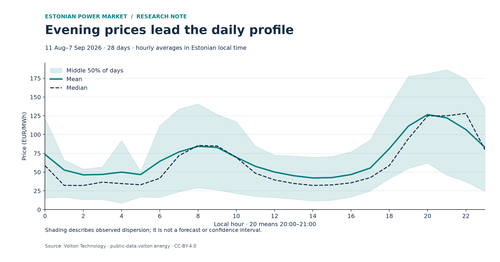

# Estonian Electricity Price Patterns

A Python analysis of Estonian day-ahead electricity prices, exploring
how prices vary by time of day and how consistently evening prices
exceed afternoon prices.

## Motivation

My background is in physical commodity trading. I built this project
to develop my electricity-market analysis skills and demonstrate how
I approach data quality, investigate patterns, and test initial findings.

## Main findings

In the original sample, 11 August–7 September 2026:

- The highest mean hourly price was **€126.61/MWh at 20:00–21:00**.
- The lowest mean hourly price was **€42.14/MWh at 14:00–15:00**.
- The daily highest hourly average occurred between **19:00 and 23:00
  on 22 of 28 days**.
- Evening average prices exceeded afternoon average prices on
  **27 of 28 days**.

All times are in **Europe/Tallinn** local time.



The shaded band shows the middle 50% of daily hourly averages.
It is not a confidence interval or a forecast range.

## Checking the pattern on another period

After inspecting the original sample, I fixed these comparison windows:

- Afternoon: **13:00–16:00**
- Evening: **19:00–23:00**

For each day, I calculated the average price in each window and
subtracted the afternoon average from the evening average.

I then applied the same definitions to the preceding four weeks,
14 July–10 August 2026.

| Measure | Original period | Earlier period |
|---|---:|---:|
| Days compared | 28 | 28 |
| Days evening was more expensive | 27 | 28 |
| Mean difference, EUR/MWh | 73.41 | 63.52 |
| Median difference, EUR/MWh | 64.97 | 60.41 |
| Weekday mean difference, EUR/MWh | 85.02 | 71.96 |
| Weekend mean difference, EUR/MWh | 44.38 | 42.42 |

The pattern persisted in the earlier period, although its magnitude
changed. This is a historical robustness check, not a forward
forecasting test.

An instructive exception was 7 September: its evening average was
€11.55/MWh below its afternoon average. Analysing that day alone
would have given a misleading impression of the wider sample.

## Data and validation

The project uses 15-minute Estonian day-ahead prices from the
[Volton Public Data API](https://public-data.volton.energy/).

Across the two periods, the dataset contains **56 complete days
and 5,376 delivery intervals**.

The data loader:

- Converts timestamps from UTC to Europe/Tallinn.
- Checks the reported units and interval length.
- Requires the exact expected sequence of delivery timestamps.
- Rejects missing, non-numeric, or infinite prices.
- Saves each validated API response with its URL and retrieval time.
- Reuses saved responses so repeated analysis uses the same snapshot.

Hourly prices are arithmetic averages of four quarter-hour prices.
The profile then summarises those hourly values across days.

### Source cross-check

For **7 September 2026**, I compared the saved Volton data with
[Elering](https://dashboard.elering.ee/en/nps/price), joining records
by UTC delivery timestamp.

All **96 timestamps and prices matched**, with zero numerical difference.

This verifies consistency for one day through a separate publication
channel. Both channels may share upstream data; this does not
independently verify the entire dataset.

## Limitations

- The sample covers two adjacent summer periods, not a full year.
- The comparison windows were selected after inspecting the original
  sample, so its results are exploratory.
- Consecutive days may be related. The observed frequency is not a
  calibrated probability for future days.
- “Weekday” means Monday–Friday; public holidays are not separated.
- Prices alone do not establish causes involving demand, generation,
  weather, or interconnector availability.
- Differences between time windows are not trading profits. No storage
  constraints, losses, fees, execution assumptions, or forecasts are modelled.
- The original latest-data response included four unexplained intervals
  beyond the expected next-day horizon. The analysis uses validated
  daily archives instead; the latest-endpoint discrepancy remains unresolved.

## Project files

| File | Purpose |
|---|---|
| `analysis.py` | Initial one-day analysis and chart |
| `market_data.py` | Reusable data loader, validation, and caching |
| `historical_analysis.py` | Original four-week analysis and chart export |
| `robustness_check.py` | Comparison with the preceding four weeks |
| `source_check.py` | One-day comparison against Elering |
| `requirements.txt` | Recorded Python package versions |
| `data/raw/` | Saved Volton responses and retrieval metadata |
| `outputs/` | Exported figures |

## Run the project

Use Python **3.14.7**. Run commands from the repository folder.

### macOS

```bash
python3.14 -m venv .venv
./.venv/bin/python -m pip install -r requirements.txt
./.venv/bin/python historical_analysis.py
./.venv/bin/python robustness_check.py
./.venv/bin/python source_check.py
```

### Windows PowerShell

```powershell
py -3.14 -m venv .venv
.\.venv\Scripts\python.exe -m pip install -r requirements.txt
.\.venv\Scripts\python.exe historical_analysis.py
.\.venv\Scripts\python.exe robustness_check.py
.\.venv\Scripts\python.exe source_check.py
```

Each computer needs its own `.venv`; it is excluded from Git.

Historical analysis reuses cached data where available. Missing archives
are downloaded. The Elering source check requires internet access.

## Data attribution

Volton Technology OÜ (2026), Volton Public Data API:
https://public-data.volton.energy/

Volton data is provided under **CC-BY-4.0**. Source metadata and attribution
are retained in the saved responses. No changes were made to the source
price values; the analysis adds time conversions, aggregations, and charts.