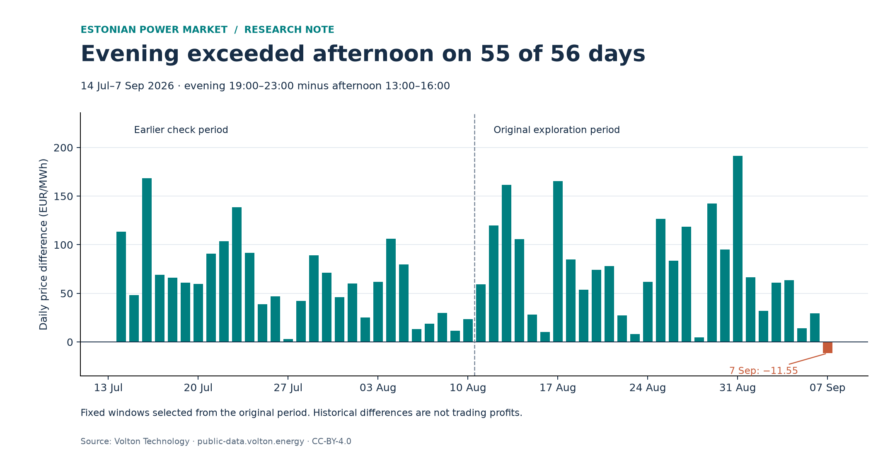

# Estonian electricity price patterns

**When were evening prices higher than afternoon prices—and how consistently?**

A reproducible Python market-analysis project using **56 days · 5,376 quarter-hour intervals · Estonia**. The analysis explores one four-week period, then checks fixed time windows on the preceding four weeks.

> **Main finding:** evening average prices exceeded afternoon average prices on **55 of 56 days** in this snapshot. The size of the difference varied substantially. This is historical evidence, not a forecast probability or trading return.



## The question and why it matters

My background is in **physical commodity operations**. This project develops my electricity-market analysis skills: checking delivery data, investigating price patterns, and examining where an initial finding holds or fails.

A daily average hides *when* electricity is expensive. Comparing delivery windows is a useful starting point for analysing flexible consumption or storage. Evaluating an actual decision would additionally require forecasts, feasible operating schedules, efficiency, costs, and execution assumptions.

## Results at a glance

All hours below are **Europe/Tallinn local time**. Afternoon means **13:00–16:00**; evening means **19:00–23:00**. Differences compare average prices, not total energy costs over unequal-duration windows.

| Measure | Original exploration | Earlier robustness check |
|---|---:|---:|
| Delivery dates, 2026 | 11 Aug–7 Sep | 14 Jul–10 Aug |
| Complete days | 28 | 28 |
| Evening more expensive | 27/28 | 28/28 |
| Mean difference (EUR/MWh) | 73.41 | 63.52 |
| Median difference (EUR/MWh) | 64.97 | 60.41 |
| Weekday mean difference (EUR/MWh) | 85.02 | 71.96 |
| Weekend mean difference (EUR/MWh) | 44.38 | 42.42 |

**The exception matters.** On 7 September, evening averaged **EUR 11.55/MWh less** than afternoon. That was the first day explored in this project; using it alone would have given a misleading impression of the wider sample.

**The pattern persisted, but its magnitude changed.** Windows were chosen after inspecting the original period and then held fixed for the earlier check. This is a historical robustness exercise, not chronological out-of-sample forecasting.

## What the hourly profile shows


In the original 28-day period:

- The highest mean hourly price was **EUR 126.61/MWh at 20:00–21:00**; the lowest was **EUR 42.14/MWh at 14:00–15:00**.
- The day's highest hourly average fell between 19:00 and 23:00 on **22 of 28 days**.
- The mean peaks at 20:00, while the median peaks at 22:00: the definition of “typical” matters.
- The shaded band is the middle 50% of daily hourly averages. It is **not** a confidence interval or forecast range.

Detailed numerical outputs: [hourly profile](outputs/hourly_profile.csv), [daily window comparison](outputs/daily_price_difference.csv), [period summary](outputs/period_comparison.csv).

## Method and data quality

1. Read the included daily [Volton API](https://public-data.volton.energy/) snapshots.
2. Validate dataset, bidding zone, units, finite numeric prices, and exact delivery timestamp coverage.
3. Convert UTC to Estonian local time; average four quarter-hour prices into each hourly price.
4. Summarise hourly prices across days and compare evening versus afternoon within each day.
5. Apply the fixed windows to the earlier period and report exceptions as well as averages.

The main analyses run **offline by default**. Cached source responses are preserved with retrieval timestamps, source URLs, and licence metadata. A missing or invalid snapshot stops the analysis rather than silently shortening the sample. Source files are never automatically refreshed.

### Pipeline consistency check

During development, all **96 timestamps and prices for 7 September 2026** matched Elering's API. Elering is one of Volton's stated upstream sources: this checks feed consistency and timestamp handling, **not independent accuracy of the underlying prices**. `source_check.py` reruns this optional live check. The Elering response from the original run is not included, so that reported match is a development observation rather than an archived second-source snapshot.

## Limitations

- Two adjacent summer periods cannot establish seasonal or year-round behaviour.
- Windows were selected from the original sample. The reported frequencies are exploratory and not calibrated probabilities; neighbouring days may be dependent.
- Weekday/weekend means a calendar split, without separate treatment of public holidays.
- Prices alone cannot identify causes involving wind, demand, outages, or interconnectors.
- Historical window differences are **not profits**. No forecast, trading strategy, battery constraints, efficiency losses, fees, or execution model is included.
- The initial `latest.json` response had four unexplained intervals beyond the expected next-day horizon. Only validated daily archives are used here; that endpoint issue remains unresolved.
- The loader checks DST-aware daily timestamps, but the hourly profile intentionally rejects clock-change days. The included summer sample has no such days.

## Reproduce the figures

The development environment was **Python 3.14.7**. `requirements.txt` records the package versions from that environment. From the repository folder:

### macOS

```bash
python3.14 -m venv .venv
./.venv/bin/python -m pip install -r requirements.txt
./.venv/bin/python historical_analysis.py
./.venv/bin/python robustness_check.py
```

### Windows PowerShell

```powershell
py -3.14 -m venv .venv
.\.venv\Scripts\python.exe -m pip install -r requirements.txt
.\.venv\Scripts\python.exe historical_analysis.py
.\.venv\Scripts\python.exe robustness_check.py
```

The scripts save figures and detailed tables in `outputs/` and exit without opening chart windows. Both computers use the same committed data but need separate `.venv` folders. Installing dependencies requires internet access; these two analyses do not.

### Optional checks

On macOS (use `.\.venv\Scripts\python.exe` on Windows):

```bash
./.venv/bin/python -m unittest discover -s tests -v
./.venv/bin/python source_check.py
```

The first command checks data validation and known snapshot results offline. The second requires internet access and compares one day with Elering.

## Repository guide

| File or folder | Purpose |
|---|---|
| `historical_analysis.py` | Original period, hourly profile, tables |
| `robustness_check.py` | Fixed-window comparison across both periods |
| `metrics.py` | Shared window definitions and calculations |
| `charts.py` | Figure styling and exports |
| `market_data.py` | Snapshot loading and validation |
| `source_check.py` | Optional live pipeline consistency check |
| `analysis.py` | Original single-day learning example; downloads live data and opens a chart |
| `data/raw/` | 56 original Volton response snapshots |
| `outputs/` | Reproducible charts and result tables |
| `tests/` | Validation and snapshot regression checks |


## Attribution

[Volton Technology OÜ (2026), Volton Public Data API](https://public-data.volton.energy/), provided under [CC-BY-4.0](https://creativecommons.org/licenses/by/4.0/). Original source attribution and licence metadata are retained in `data/raw/`. Source price values are unchanged; time conversion, aggregation, and visualisation are derived work.

The data licence applies to the source data; no separate software licence has been selected for this repository.
